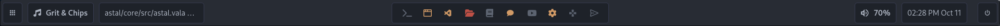

# Morghulis
- [Morghulis](#morghulis)
  - [Requirements](#requirements)
  - [Usage](#usage)
    - [Development](#development)
    - [Installation](#installation)
    - [Nix](#nix)
  - [Features](#features)
  - [Preview](#preview)
  - [License](#license)

Desktop Shell, created with [gtk4-layer-shell](https://github.com/wmww/gtk4-layer-shell).

## Requirements

- [Hyprland](https://hyprland.org/)
- [Vala](https://vala.dev/), [Meson](https://mesonbuild.com/), [Make](https://www.gnu.org/software/make/)
- [Astal](https://github.com/Aylur/astal)

## Usage

```shell
git clone https://github.com/ARKye03/morghulis
cd morghulis
meson setup build
```

### Development

```shell
make
```

### Installation

```shell
meson install -C build
morghulis --help
```

### Nix
There is a `flake.nix` file, with a `devShell`, so you can use it to develop.
```shell
nix develop
```
or try the desktop shell with:
```shell
nix run github:ARKye03/morghulis -- --help
```

## Features

- [x] Status Bar
    - [x] Workspace Switcher
    - [x] Media Player
    - [x] Volume Controller
    - [x] Focused Client
- [x] Socket Service
- [ ] Notifications
    - [ ] Center
    - [ ] Popup
- [ ] OnScreenDisplay
  - [ ] Audio
  - [ ] Brightness
- [ ] Apps Runner
- [ ] Quick Settings
- [ ] Dynamic CSS

## Preview


## License

This project is licensed under the WTFPL, see the [LICENSE](./LICENSE) file for more details.
