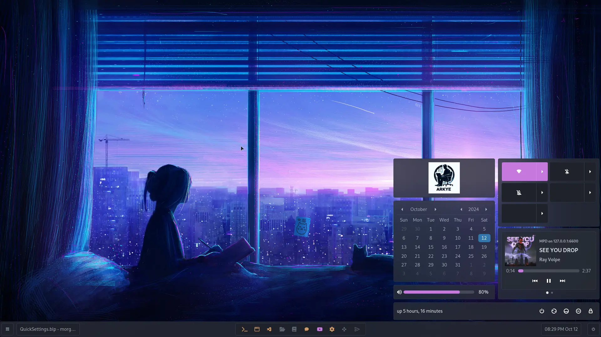

# Morghulis
- [Morghulis](#morghulis)
  - [Requirements](#requirements)
  - [Usage](#usage)
    - [Development](#development)
    - [Installation](#installation)
    - [Nix](#nix)
  - [Features](#features)
  - [Preview](#preview)
  - [License](#license)

Desktop Shell, created with GTK4, Blueprint and Vala.

## Requirements

- [Hyprland](https://hyprland.org/).
- [Vala](https://vala.dev/), [Meson](https://mesonbuild.com/), [Make](https://www.gnu.org/software/make/).
- [Astal](https://github.com/Aylur/astal).
- [Libadwaita](https://gitlab.gnome.org/GNOME/libadwaita).
- [Blueprint-Compiler](https://jwestman.pages.gitlab.gnome.org/blueprint-compiler/).
- [gtk4-layer-shell](https://github.com/wmww/gtk4-layer-shell).

## Usage

```shell
git clone https://github.com/ARKye03/morghulis
cd morghulis
meson setup build
# arch-meson build # Opinionated option for Arch Linux, recommended.
```
or use/install a binary from [releases](https://github.com/ARKye03/morghulis/releases).

> [!WARNING]  
> Still need the dynamic libraries installed in your system.


### Development

```shell
make
```

### Installation

```shell
meson install -C build
morghulis --help
```

### Nix
There is a `flake.nix` file, with a `devShell`, so you can use it to develop.
```shell
nix develop
meson setup buildNix
make nixbuild # Build the desktop shell.
make nixdev # Build and run the desktop shell.
```
or try the desktop shell with:
```shell
nix run github:ARKye03/morghulis -- --help
```

## Features

- [x] Status Bar
    - [x] Workspace Switcher
    - [x] Volume Controller
    - [x] Focused Client
- [x] Socket Service
- [ ] [WIP] Quick Settings
    - [x] Media Player
- [x] Apps Runner
    - [ ] Handle Hyprland Clients
- [ ] Notifications
    - [ ] Center
    - [ ] Popup
- [ ] OnScreenDisplay
  - [ ] Audio
  - [ ] Brightness
- [ ] Dynamic CSS

## Preview


> [!NOTE]  
> The preview was made with adw-gtk One-Dark theme.

## License

This project is licensed under the WTFPL, see the [LICENSE](./LICENSE) file for more details.
