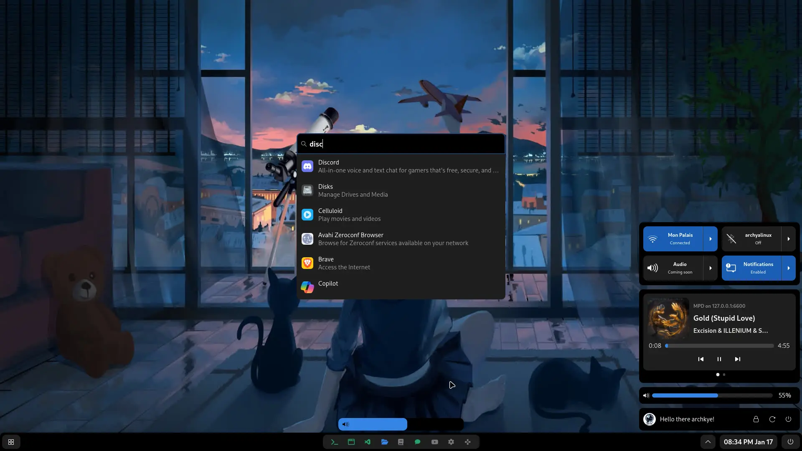

# Morghulis

- [Morghulis](#morghulis)
  - [Requirements](#requirements)
  - [Installation](#installation)
    - [From source](#from-source)
    - [Arch Linux](#arch-linux)
  - [Usage](#usage)
    - [Style](#style)
  - [Development](#development)
    - [Nix](#nix)
  - [Features](#features)
    - [Thanks to](#thanks-to)
  - [License](#license)

A Wayland desktop shell created with GTK4, Libadwaita, and Astal.



> [!NOTE]
> The preview uses custom Adwaita colours, loaded directly from `$XDG_CONFIG_HOME/morghulis/main.css`. This allows custom shell colors without affecting the system-wide GTK theme.

## Requirements

- [River](https://codeberg.org/river/river/), or [Hyprland](https://hyprland.org/)
- [Vala](https://vala.dev/), [Meson](https://mesonbuild.com/), [Just](https://github.com/casey/just)
- [Libadwaita](https://gitlab.gnome.org/GNOME/libadwaita) & Adwaita Theme.
- [Blueprint-Compiler](https://jwestman.pages.gitlab.gnome.org/blueprint-compiler/)
- [GTK](https://www.gtk.org/)
  - [gtk4](https://docs.gtk.org/gtk4/)
  - [gtk4-layer-shell](https://github.com/wmww/gtk4-layer-shell)
- [GSound](https://gitlab.gnome.org/GNOME/gsound)
- [Astal](https://github.com/Aylur/astal)
  - Tray
  - Wireplumber
  - Mpris
  - NotifD
  - Network
  - Bluetooth
  - Apps
  - River (Optional)
  - Hyprland (Optional)
  - <details> <summary>Battery</summary>
      While it might not be used, its mandatory to install it (For now).
    </details>
  - <details> <summary>Power Profiles</summary>
      While it might not be used, its mandatory to install it (For now).
    </details>
- [libgtop](https://gitlab.gnome.org/GNOME/libgtop)

> [!NOTE]
> Optional dependencies are not required only if built from source; the binary release requires all.

## Installation

### From source

```shell
git clone https://github.com/ARKye03/morghulis
cd morghulis
just init
just install
```

### Arch Linux

It's on AUR so, using yay or any other helper:

```sh
yay -S morghulis-git
```

Alternatively, use this [PKGBUILD](https://raw.githubusercontent.com/ARKye03/PKGBUILDS/refs/heads/trunk/morghulis-bin/PKGBUILD), that will install latest [release](https://github.com/ARKye03/morghulis/releases).

## Usage

Morghulis is a desktop shell that handles also cli.

```shell
morghulis --help
```

> [!NOTE]
> The CLI currently offers simple commands to start the application, toggle windows, and show the inspector.

### Style

You can change the style of Morghulis by creating the file `$XDG_CONFIG_HOME/morghulis/main.css`. _Hot Reload_ is supported. As previously mentioned, an Adwaita theme is encouraged.

## Development

```shell
just init
just
```

### Nix

Use `flake.nix` for development:

```shell
nix develop
```

Or run it with:

```shell
nix run github:ARKye03/morghulis -- --help
# For non-NixOS distro
nix run github:ARKye03/morghulis#fhs -- --help
```

## Features

- [x] Status Bar
  - [x] Tags/Workspaces Module
  - [x] Focused View/Client
  - [x] Active Mode/Submap
  - [x] Systray
- [x] Quick Menu
  - [x] Mpris Media Player
  - [x] Power Buttons
  - [x] Power Profiles
  - [x] Bluetooth
  - [x] Network
    - [x] Wifi
    - [ ] Ethernet
  - [x] Audio
- [x] Battery Support
- [x] Runner
  - [x] Run apps
  - [x] Solve math expressions
  - [ ] Handle Hyprland Clients
  - [ ] Handle River views?
- [x] Notifications
  - [x] Center
  - [x] Popup
  - [x] Don't Disturb logic
- [x] Power Popup Menu
- [x] OnScreenDisplay
  - [x] Audio
  - [x] Brightness
- [x] Backligh
- [x] Hot Reload CSS

> [!WARNING]
> **Users must be part of the `video` group to use backlight services.**
>
> For OSD to work, you need to append `"morghulis -r change_volume" and/or" morghulis -r change_brightness"` to whatever keybinding you want to use to raise/lower the volume/brightness.
> Example:
>
> ```hyprlang
> binde=, XF86MonBrightnessUp, exec, brightnessctl set +10% & morghulis -r change_brightness
> ```

### Thanks to

- [kotontrion](https://github.com/kotontrion) and its [kompass](https://github.com/kotontrion/kompass) project for inspiration, code snippets, and guidance.
- [Aylur](https://github.com/Aylur) for the awesome project [Astal](https://github.com/Aylur/astal) is.

## License

Licensed under the MIT. See the [LICENSE](./LICENSE) file for details.
